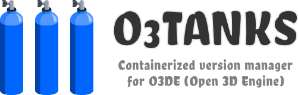

# O3TANKS


O3Tanks is a version manager for [O3DE (Open 3D Engine)](https://o3de.org) to handle multiple engine installations. It relies on containers to reduce dependencies on the host machine, easing the creation of portable development environments or the addition into CI/CD pipelines.

Features:
- Download, build and install engine versions from any Git repository (official or forks).
- Check for engine updates and apply them automatically (if any).
- Bind a project to a specific engine version.
- Build, edit and run a project using its bound engine version. (*WORK IN PROGRESS*)

**DISCLAIMER: This is an experimental tool at an early development stage. Its use in production environments is discouraged. Use it at your own risks!**

## Install

> Differences between two modes are available in the [Overview](https://github.com/loherangrin/o3tanks/wiki/overview) page.

1. Verify you meet the following requirements, according to the preferred mode:
   - **Containerized mode (Linux only)**
     - Docker Engine 19.03 (or greater), both root and rootless mode are supported. See [official documentation](https://docs.docker.com/get-docker/) for installation details.
     - NVIDIA Docker 2 (or greater), if using a NVIDIA GPU with proprietary drivers. See [official documentation](https://docs.nvidia.com/datacenter/cloud-native/container-toolkit/install-guide.html) for installation details.

   - **Native mode (Linux, MacOS, Windows)**
     - CMake 3.20.5 (or greater).
     - Python 3.8 (or greater).
     - pygit2 1.6.1 (or greater).

2. Clone this repository into a directory of your choice.
3. (Optional) Register `o3tanks` globally to be called from any location:
   - on Linux or MacOS, create a symbolic link to the main shell script:
     ```
     sudo ln -s <YOUR_O3TANKS_DIR>/o3tanks.sh /usr/local/bin/o3tanks
     ```
   - on Windows, add the installation directory to `PATH` in your System > Environment Variables.

## Quick Start

> More detailed instructions are available in the [Get Started](https://github.com/loherangrin/o3tanks/wiki/get-started) page.

Install the latest engine version from the official repository:
```
o3tanks install development
```

Initialize a new empty project:
```
mkdir my_project
cd my_project
o3tanks init --engine development --as MyProject
```

Open the editor to develop the project:
```
o3tanks open
```

Build and run an instance of the project:
```
o3tanks build client
o3tanks run client
```

See which engine version the project is using:
```
o3tanks settings engine
```

Keep the engine installation up-to-date:
```
o3tanks refresh development
o3tanks upgrade development
```

Display a description of available commands and options:
```
o3tanks help
o3tanks help <command>
```

Please refer to the [main documentation](https://github.com/loherangrin/o3tanks/wiki) for more complex scenarios, such as installing the engine from your personal fork or changing project settings.

## Update

After the first installation, O3Tanks is able to update itself downloading the latest files from the repository where it was installed from:
```
o3tanks refresh self
o3tanks upgrade self
```

## Contribute

We are happy to receive your feeback! Please open an issue in [our tracker](https://github.com/loherangrin/o3tanks/issues) if you would like to propose a new feature or you have encountered any error.

To get involved in the development of O3Tanks, please refer to our [contribution guidelines](./CONTRIBUTING.md).

## License

O3Tanks is licensed under the Apache License, version 2.0. Please see [LICENSE](./LICENSE) and [NOTICE](./NOTICE) files for further details.
